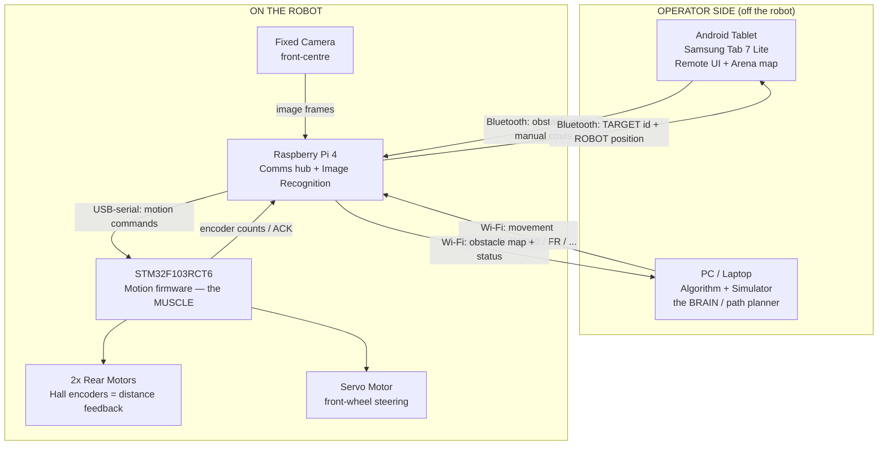

# MDP Autonomous Remote Car — High-Level System Overview

> SC2079 / CE3004 — the "how does this whole thing work" view, before the technical deep-dives.

The car is **not one device**. It's **four computers talking to each other**, and the car itself is the dumbest of them. Understand the conversation between them and you understand the system.

---

## System Architecture

---

## The Four Players (and what each actually does)

### 1. PC / Laptop — the brain
**Not on the car.** Runs the path-planning algorithm and the simulator. It decides *where the car should go and in what order*: given the obstacle layout, it computes a route that visits all 5 obstacles and outputs a list of movement commands.

### 2. Android Tablet — the operator's console
Two jobs:
- **(a)** You place the obstacles on a virtual 200×200 cm grid and tell the system which face each image is on.
- **(b)** It's also a manual remote for driving the car directly.

It displays live status — the car's position and what image was recognised.

### 3. Raspberry Pi 4 — the switchboard + the eyes
The only thing that talks to **everyone**:
- Wi-Fi **access point** for the PC
- Bluetooth **slave** for the tablet
- USB-serial **master** for the STM

It **also** runs image recognition on frames from the camera. Think of it as the spinal cord plus the visual cortex.

### 4. STM32 — the muscle
A microcontroller that does exactly one thing: turn text commands like `FW010` ("forward 10 cm") into motor and servo movement, and read the wheel encoders to know how far it actually went. It has no concept of "the task" — it just executes primitives.

---

## How a Run Actually Flows

| Step | What happens | Link used |
|---|---|---|
| 1. Setup | Tablet: lay out the 5 obstacles + target faces | → BT → RPi → Wi-Fi → PC |
| 2. Plan | PC computes visiting order + path, streams movement commands | PC → Wi-Fi → RPi |
| 3. Move | RPi forwards each command; STM drives motors (encoder-tracked) + steers via servo; car stops ~20 cm from the obstacle face | RPi → USB-serial → STM |
| 4. See | Camera frame → RPi runs recognition → identifies image ID | CAM → RPi |
| 5. Report | RPi sends `TARGET, <obstacle>, <id>` and `ROBOT, x, y, direction` | RPi → BT → Tablet |
| 6. Repeat | Until all obstacles recognised or the 6-minute clock expires | — |

---

## The One Architectural Fact That Bites Everyone

This car has **Ackermann-style steering** — a servo turning the front wheels — **not** differential drive. **It cannot turn on the spot.**

Every turn is an **arc** with roughly a **25 cm turning radius that grows wider the faster you go**.

If your algorithm assumes point-turns, the plan it produces is **physically impossible**, and integration fails in Week 4 when there's no time left to fix it. The "brain" on the PC has to plan in **arcs** (think Dubins paths) from day one.

---

## Arena Facts to Design Against

- Arena: **200 cm × 200 cm**, virtual boundaries. START zone 40×40 cm, bottom-left.
- **5 obstacles**, each 10×10 cm. One face holds the target image; the other three show bull's-eye markers.
- Robot footprint **20 × 21 cm**, camera front-centre.
- Best recognition distance ≈ **20 cm** from the obstacle.
- **15 images** in the pool; competition shows **up to 5**.
- Full points = all 5 recognised within the **6-minute** timeout; ties broken by **time**.

---

## Two Modes, One Machine

1. **Manual** — drive directly from the tablet (Bluetooth → RPi → STM).
2. **Autonomous** — the PC algorithm plans and the car runs the route itself.

The same comms backbone carries both. The only difference is *who is generating the commands* — your thumb on the tablet, or the path planner on the laptop.

---

*Next deep-dives available: comms protocol & string formats · steering / path-planning math · image-recognition pipeline · STM motion firmware.*