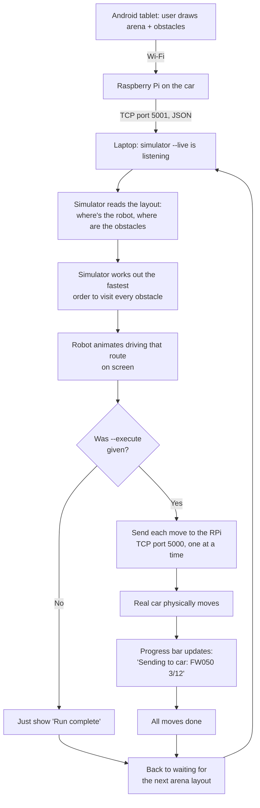

# How `--live` mode works (plain-English guide)

This explains the feature added so the simulator can plug into the real
competition run: receive the arena layout over Wi-Fi, plan and animate the
route, then actually drive the car through it.

## The story, in one paragraph

Someone draws the arena (where the robot starts, where the 5 obstacles are)
on the Android tablet. The tablet sends that layout to the Raspberry Pi
sitting on the car. Our laptop, running the simulator in `--live` mode, is
also connected to the car's Wi-Fi and is listening for that layout. The
moment it arrives, the simulator works out the shortest route that visits
every obstacle, animates the robot driving that route on screen — and then,
if we've told it "for real this time" (`--execute`), it sends the same
movement commands to the actual car, one at a time, waiting for each one to
finish before sending the next. The screen shows a progress bar the whole
time. When the car finishes, the simulator goes back to waiting for the next
layout.

## Flowchart

## Who does what (file map)

| File | Job, in plain terms |
| --- | --- |
| [`simulator/main.py`](simulator/main.py) | The whole show. Opens the on-screen window, listens for `--live`/`--execute` flags, and runs the loop: *wait → plan → animate → (maybe) drive the car → repeat*. |
| [`arena_feed.py`](arena_feed.py) | The "phone line" to the Raspberry Pi. Connects, reads the arena layout it sends, translates grid squares into real centimeters, and reports status back ("still planning", "done", "error"). |
| [`simulator/planner.py`](simulator/planner.py) | The route-planning brain. Given the robot's starting spot and where every obstacle is, it figures out the shortest order to visit them all and turns that into a list of moves (`FW050` = forward 50cm, `RL090` = turn left 90°, etc). |
| [`comms.py`](comms.py) | The "walkie-talkie" to the physical car. Sends one move at a time to the Raspberry Pi and waits for "done" before sending the next. |
| [`live_arena.py`](live_arena.py) | A no-graphics version of the same idea — useful for testing the network/planning part without opening a window. |
| [`verify_live_sim.py`](verify_live_sim.py) | A stand-in test: pretends to be the Raspberry Pi and the car (fake versions on your own laptop) so you can check the whole flow works without needing the real hardware. |

## The "modes" the simulator can be in

Think of it as a light switching between four states, shown live on screen:

1. **Waiting** — "Waiting for arena data from 192.168.x.x:5001..." Nothing to do yet.
2. **Animating** — the layout arrived, the route is worked out, and you watch the robot drive it on screen (this always happens, even without `--execute` — it's the "dry run").
3. **Executing** *(only with `--execute`)* — the same moves are now being sent to the real car, one by one, with a progress bar.
4. **Done** — "Run complete — waiting for next arena snapshot." Loops back to step 1 automatically, so it's ready for the next round without restarting anything.

## Why two separate steps (animate, then execute)?

So you can see the planned route before committing the physical robot to
move — if the plan looks wrong, you find out from the screen animation, not
by watching the car crash into a wall.
