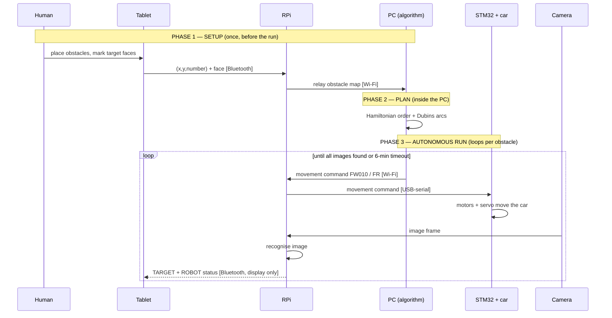

# MDP Car — How It Actually Functions, Step by Step

> The point of this doc: kill the "who's the boss" confusion. There is no single boss. The system is distributed, and **which device is in charge changes depending on the moment.** Read the timing column, not just the arrows.

---

## The one rule that explains everything

**Nothing moves the car except commands arriving at the STM32 over USB-serial — and the RPi is the only device wired to the STM.**

So the car *physically* always obeys the RPi. The real question is never "tablet or PC?" It's **"who is feeding the RPi right now?"** — and that answer flips between two modes.

```
EVERY command, no matter the source, funnels through here:

   [ source ] ──> RPi ──USB-serial──> STM32 ──> motors + servo ──> car moves
```

---

## Two modes — memorise this split

| | MANUAL mode | AUTONOMOUS mode (the competition) |
|---|---|---|
| Who generates commands | **You**, pressing tablet buttons | **PC algorithm**, on its own |
| Path of a command | Tablet → BT → RPi → STM | PC → Wi-Fi → RPi → STM |
| Tablet's role | The controller | Display only (watches, doesn't drive) |
| PC's role | Not involved | The driver |
| When you use it | Testing, positioning the car in the start zone | The actual graded run |

They are **never both active at once.** One source feeds the RPi at a time.

---

## The full sequence, phase by phase

### PHASE 0 — Power-up & connectivity (before anything moves)
1. Charge the battery (green LED = full). A flat battery mid-demo is an avoidable zero.
2. RPi boots as a **Wi-Fi access point** (for the PC) and a **Bluetooth slave** (for the tablet), and opens the **USB-serial** link to the STM.
3. Tablet connects to the RPi over Bluetooth (checklist C.2). PC connects to the RPi over Wi-Fi (IP socket, server-client).
4. Result: all three links live — Tablet↔RPi (BT), PC↔RPi (Wi-Fi), RPi↔STM (USB-serial).

### PHASE 1 — SETUP: author the arena (tablet is the SOURCE OF TRUTH here)
5. The 5 obstacles are placed physically in the real 200×200 cm arena.
6. On the **tablet's arena canvas**, the human recreates that layout: touch-place each numbered obstacle (C.6), drag to position, tap which **face** holds the target image (C.7).
7. On finger-lift, the tablet transmits each obstacle's `(x, y, number)` + target-face over **Bluetooth → RPi → relayed to PC**.
8. **This happens ONCE, before the run.** Obstacles don't move, so coordinates are never re-sent during driving.

> Why this phase exists: the PC algorithm has **no eyes**. It cannot see the arena. The only way it learns the obstacle layout is a human typing it in via the tablet. The tablet is the *origin* of the map; the PC is the *consumer* of it.

### PHASE 2 — PLAN: PC computes the route (happens entirely inside the PC)
9. From the fixed obstacle map, the PC computes the **visiting order** — a Hamiltonian path touching each obstacle once (with only 5 obstacles, brute-forcing all 120 orderings is trivial and optimal).
10. For each leg, it computes the actual **trajectory** respecting the car's steering: arcs at minimum turning radius (Dubins-style), **not** point-turns.
11. Output: an ordered list of movement commands (`FW010`, `FR`, `BW010`, …).

### PHASE 3 — RUN: the autonomous loop (PC drives, RPi sees, tablet watches)
This repeats per obstacle until done:

12. **Command** — PC streams the next movement command over Wi-Fi → RPi → USB-serial → STM.
13. **Move** — STM drives the rear motors (distance tracked by **Hall encoders**) and steers via the **servo**. Car arrives ~20 cm from the obstacle face.
14. **See** — Camera captures a frame → **RPi runs image recognition** → identifies the target ID.
15. **Report back** — RPi sends status to the tablet for display only:
    - `TARGET, <obstacle>, <id>` → tablet stamps the recognised ID on the block (C.9).
    - `ROBOT, <x>, <y>, <direction>` → tablet moves the robot icon on the map (C.10).
16. Loop to step 12 for the next obstacle.

### PHASE 4 — END
17. Run ends when all 5 images are recognised **or** the **6-minute** timeout hits.
18. Score = images recognised within the limit; ties broken by **time**.

---

## "Who sends what, when" — the part everyone gets wrong



**Read the timing:**
- Obstacle coordinates: **tablet → once → at setup.** The PC is the *consumer*, never the source.
- Movement commands: **PC → continuously → during the run.**
- Status (`ROBOT`, `TARGET`): **RPi → during the run → to the tablet, for display only.** The tablet is a mirror here, not a controller.

---

## The mental model to lock in

- **PC** = planning brain (route). Only drives in autonomous mode.
- **RPi** = comms hub **and** vision brain (image recognition). Always the gateway to the car.
- **STM32** = muscle. Executes movement primitives; reads encoders. Zero awareness of "the task."
- **Tablet** = human interface. Authors the map going in (setup), mirrors robot status coming out (run). Drives the car only in manual mode.
- **Camera** = the only sensor that sees images. Feeds the RPi.

Stop hunting for one central controller. There isn't one. The correct question is always: **in which mode, at which moment, who is doing what.**

---

## Self-test (answer without scrolling up)

1. During the autonomous run, what is the PC sending, and what is the tablet doing?
2. Obstacle coordinates: sent once or continuously? From which device?
3. The car physically takes orders from which single device, in *both* modes?

If any answer makes you reach for "the PC controls everything," you haven't got it yet.
